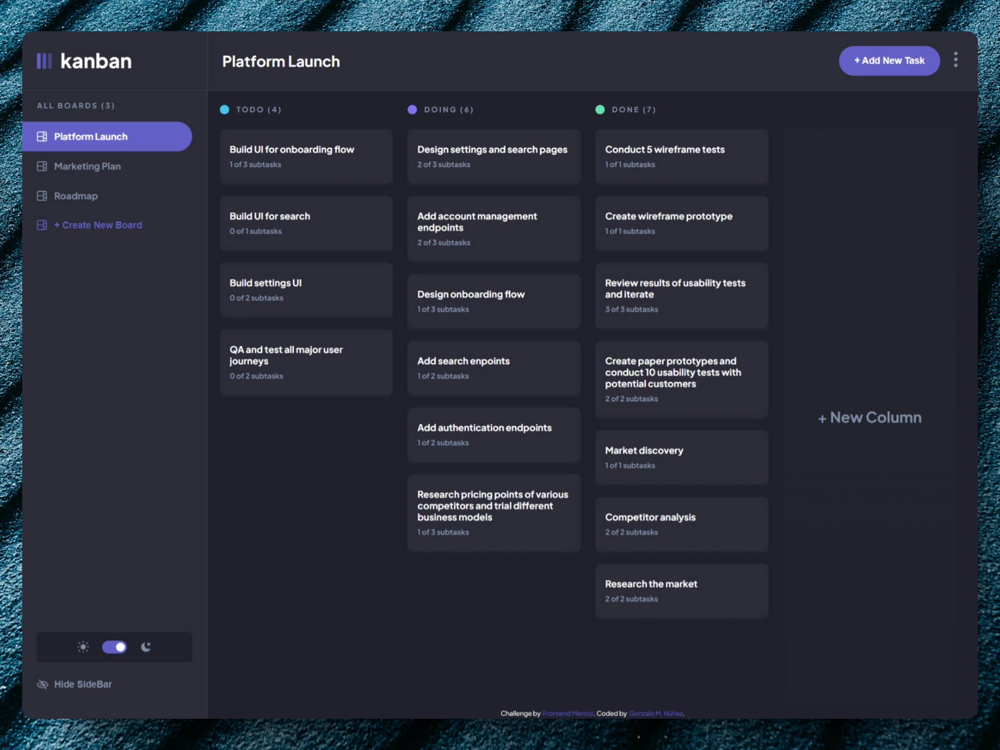
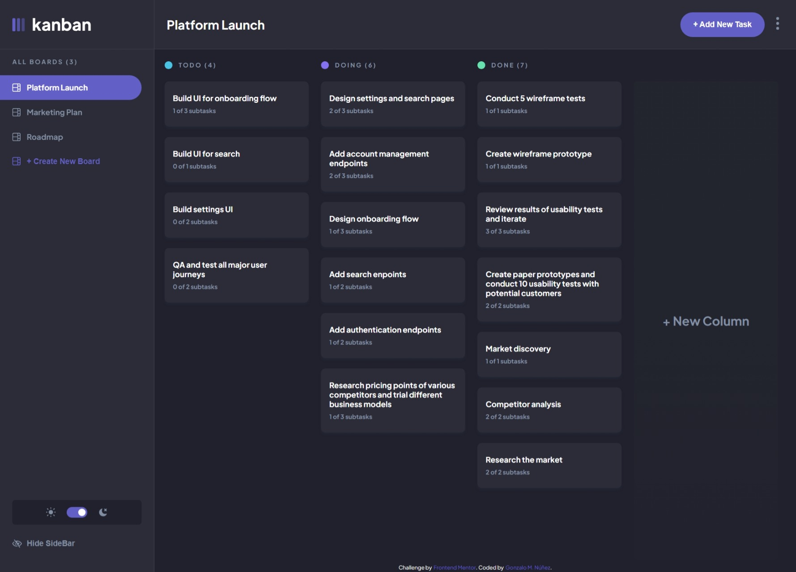
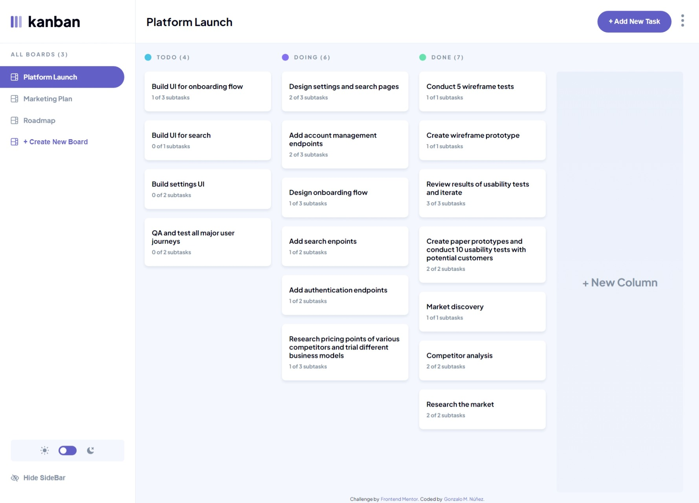
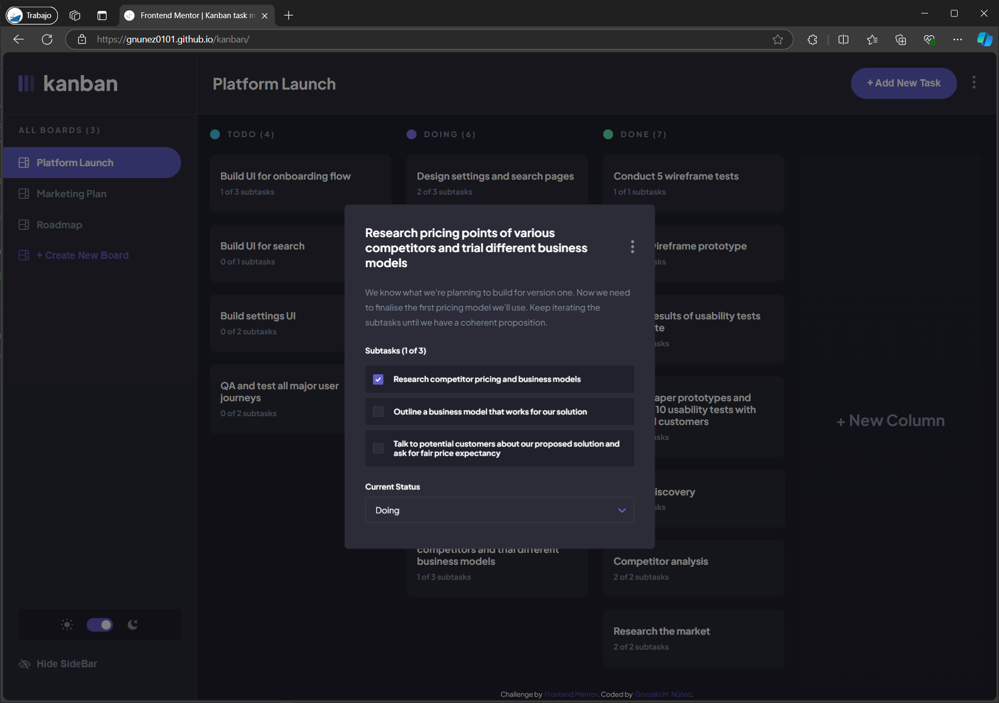
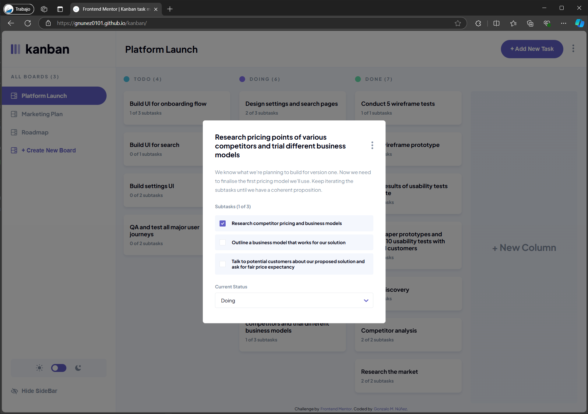
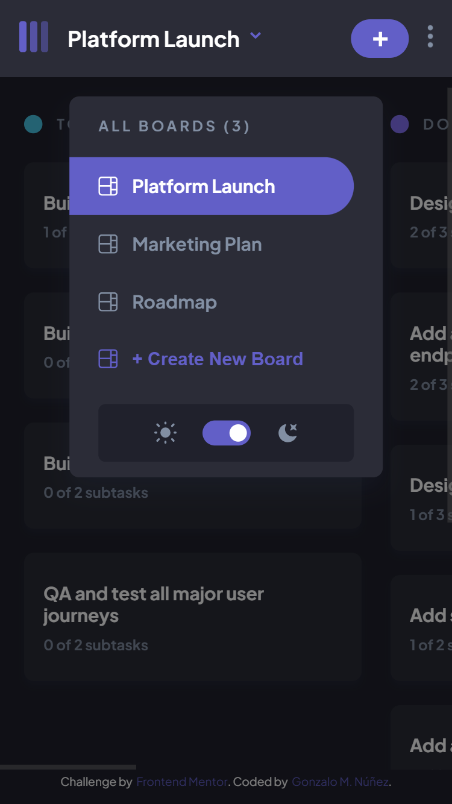
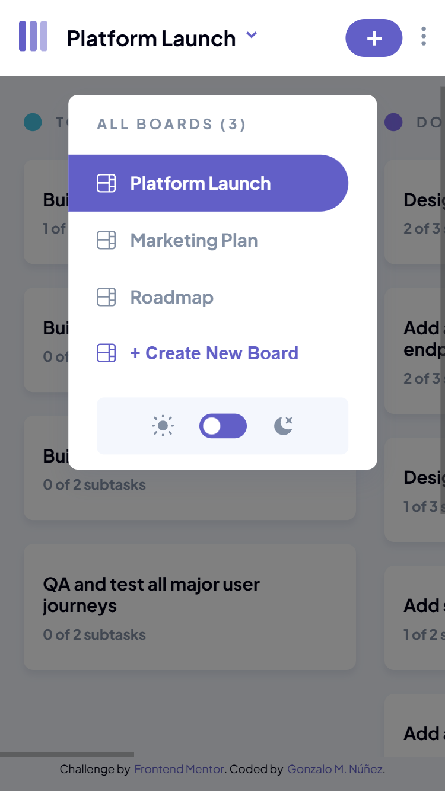
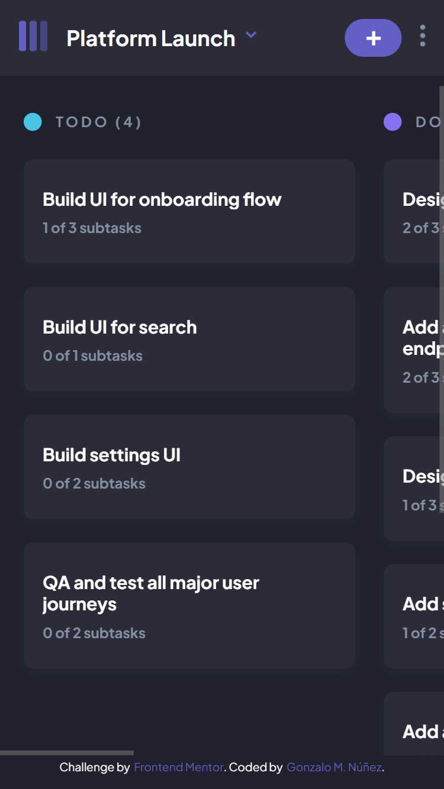
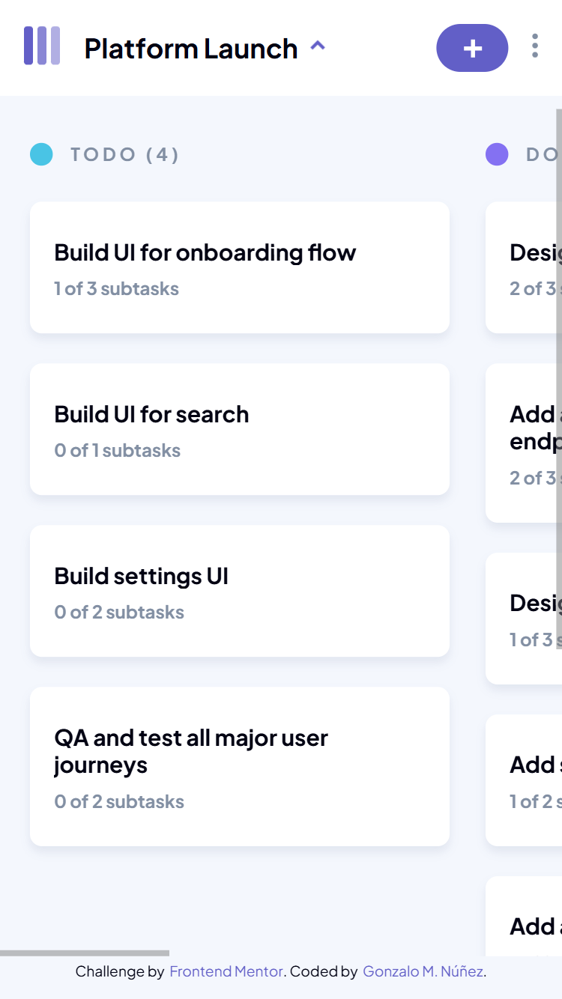

# Frontend Mentor - Kanban task management web app solution

This is my solution to the [Kanban task management web app challenge on Frontend Mentor](https://www.frontendmentor.io/challenges/kanban-task-management-web-app-wgQLt-HlbB). Frontend Mentor challenges help you improve your coding skills by building realistic projects. 

## Table of contents

- [Overview](#overview)
  - [The challenge](#the-challenge)
  - [Screenshots](#screenshots)
  - [Links](#links)
- [My process](#my-process)
  - [Built with](#built-with)
  - [What I learned](#what-i-learned)
  - [Useful resources](#useful-resources)
- [Author](#author)

## Overview

### The challenge

Users should be able to:

- View the optimal layout for the app depending on their device's screen size
- See hover states for all interactive elements on the page
- Create, read, update, and delete boards and tasks
- Receive form validations when trying to create/edit boards and tasks
- Mark subtasks as complete and move tasks between columns
- Hide/show the board sidebar
- Toggle the theme between light/dark modes
- **Bonus Completed**: Allow users to drag and drop tasks to change their status and re-order them in a column
- **Bonus Completed**: Keep track of any changes, even after refreshing the browser (`localStorage` used)

### Screenshots

### Links

- Solution URL: [https://github.com/gnunez0101/kanban](https://github.com/gnunez0101/kanban)
- Live Site URL: [https://gnunez0101.github.io/kanban/](https://gnunez0101.github.io/kanban/)

## My process

My process began with making all layouts with HTML, then, working from top to bottom with styling for mobile layout first. I styled every element statically just for laying out the UI, taking the sizes and styles from the example images provided on Figma file. The rest was put everything to work with buttons and controls and managing the JSON file to keep changes on Localstorage.

### Built with

- Semantic HTML5 markup
- Pure CSS3 with latest updates
- CSS custom properties
- CSS Flexbox
- Mobile-first workflow
- [React](https://reactjs.org/) - JS library.
- [Typescript](https://www.typescriptlang.org/) - TypeScript is JavaScript with syntax for types.
- [Vite](https://vitejs.dev/) - Next Generation Frontend Tooling.
- [Framer Motion](https://www.framer.com/motion/) - A production-ready motion library for React.
- [Immer](https://immerjs.github.io/immer/) - Tiny package that allows you to work with immutable state in a more convenient way.
- [React Select](https://react-select.com/home) - A flexible and beautiful Select Input control for ReactJS with multiselect, autocomplete, async and creatable support.
- [Simple React Clickaway Hook](https://github.com/ViveDevelopment/simple-react-clickaway) - Simple react useClickAway hook, which listens for clicks outside the element.
- [Figma](https://www.figma.com/) - Versatile web design tool that enables real-time collaboration for building interactive user interface prototypes.

### What I learned

On this challenge I learned:

- Working from [Figma](https://www.figma.com/) designs. This was my first GURU challenge and the first using a Figma file as reference for the UI.
- Using very complex and deeply nested *JSON* data structures.
- Manage complex data structures with [Immer](https://immerjs.github.io/immer/) library.
- Manage complex states with React `useContext` hook to keep the JSON data global and accesible to all components on application.
- Using `useReducer` hook to replace useState for really complex states.
- Drag & Drop operations with native HTML API and events and also using `Reorder` feature of [Framer Motion](https://www.framer.com/motion/).

### Useful resources

- [Framer Motion](https://www.framer.com/motion/) - A production-ready motion library for React. This helped me a lot with ready to use professional animations and esay to learn code to implement them. A great recommended! I will continue using it for all of my future projects.
- [Immer](https://immerjs.github.io/immer/) - Tiny package that allows you to work with immutable state in a more convenient way. A really nice package for complex JSON data structures, making simple to manage them with a lot less code.

## Author

- Website - [Gonzalo Manuel Núñez Bósquez](https://github.com/gnunez0101)
- Frontend Mentor - [@gnunez0101](https://www.frontendmentor.io/profile/gnunez0101)